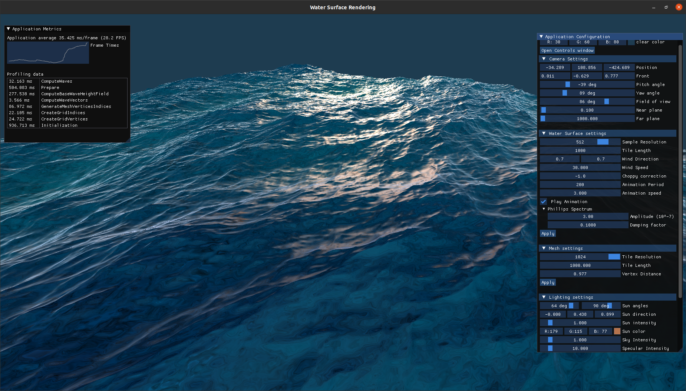
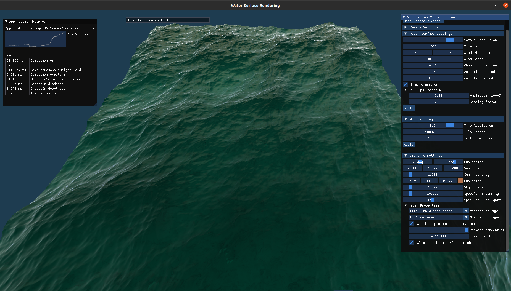
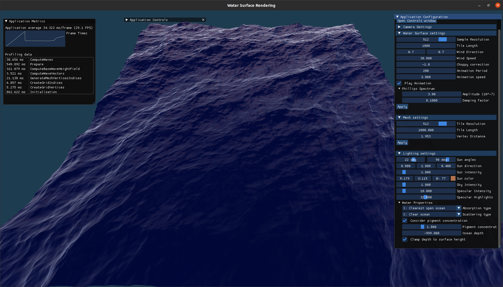
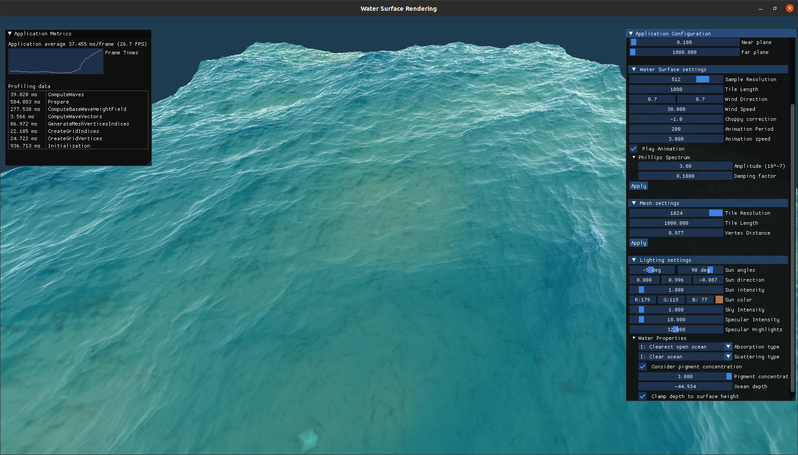
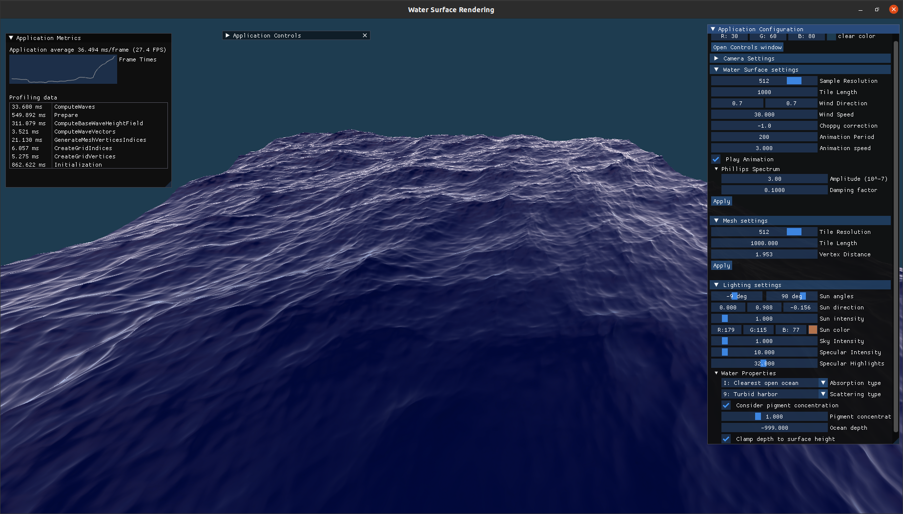
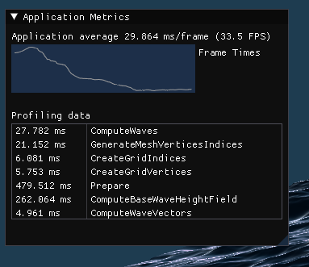

Water Surface Rendering
=======================
Experimenting with real-time water surface generation and rendering in 3D using C++ and Vulkan.
The application synthetizes a patch of ocean based on a selected surface model with various customizable parameters.

## Features

* Tessendorf's choppy wave surface model generation using FFT on CPU [[1]](#sources)
* Rendered as a displaced mesh (a grid of vertices)
* Shading based on article by Baboud, Décoret, oceanic data, optic laws [[3],[2],[1],[4]](#sources)
* Simple underwater terrain using value noise to get some details underwater
* GUI interface - allows for modification of parameters at runtime
* FPS Camera
* Profiling

For more info, see Section [How it Works](#how-it-works).

|   |   |
|---|---|
|||
|||
|||

Profiling window:


* Profiling data structure tracks the duration of each unique profiling record ordered by the most recently updated.
* Using i5-6200U (2-core, 4 threads) CPU with AVX enabled and NVIDIA GT 940M, at 512x512 tile resolution the application runs at ~34 FPS. There is lot of room for optimization. 


### TODO: possible features in the future
In no particular order:
* Endless - solving the tiling artifacts
* Gerstner waves model (in compute shaders?)
* Rendering: Ray marched
* Atmospheric model, e.g. Preetham [5]
* LOD
* Foam rendering
* Caustics? terrain plane?
* Optimization of wave generation, (compute shaders?)

## Dependencies
* C++17 compilant compiler
* CMake
* Vulkan SDK

### Used Libraries
* window abstraction: [GLFW3](https://github.com/glfw/glfw)
* logging library: [SPDLOG](https://github.com/gabime/spdlog)
* math library: [GLM](https://github.com/g-truc/glm)
* GUI library: [ImGui](https://github.com/ocornut/imgui/)
* image loading library: [STB](https://github.com/nothings/stb)
* shader tools (e.g. compilation): [Shaderc](https://github.com/google/shaderc)
* FFT library: [FFTW](http://fftw.org/) version 3.3.10

## How to compile
Tested on Ubuntu 20.04 LTS, in root dir:
```
$ mkdir build && cd build
$ cmake ..
$ make
$ ./water
```

## How it Works

### Representation
Water surface is represented using two 2D textures - height maps:
* Displacement map: each sample contains horizontal displacements and vertical displacement (height),
* Normal map: each sample contains slope, and displacement derivatives to compute the normal.

These two textures are computed on CPU based on the Tessendorf's choppy waves method of simulating ocean surfrace [1] using FFTW library.

### Mesh
A square grid of vertices is computed, with predefined resolution (number of vertices per side) and the distance between them. 
This mesh is then rendered with the two textures bound. Vertex positions are displaced using the displacement map. Normals are obtained by sampling the normal map and computing the vertex' normal [1].

### Shading

The color of the water surface is computed per fragment based on the methods in articles [2] and [3] with the use of geometrical (ray) optics equations mentioned in [4]. Water surface is treated as a collection of locally planar facets. Light transport across a flat surface is simulated based on Blinn-Phong reflection model.
In short: Rays are traced from the camera to each fragment on the water surface. At the fragment's position, sky and sun contributions are computed. Then the ray gets refracted along the surface and it is absorbed and scattered in the water until it reaches an imaginary underwater ground plane at a certain depth. The final color is composited from these contributions using Fresnel's formula.

Based on Tessendorf's notes [1], the amount of outgoing radiance $L$ from a fragment on the water surface (simply fragment) to the camera is computed in simplified terms as:
```math
L = F_r L_s + F_r L_a + F_t L_u,
```
where 
- $F_r$ is the Fresnel reflectivity for reflection from the fragment to the camera,
- $L_s$ is the amount of light coming directly from the sun to the fragment where it is reflected to the camera,
- $L_a$ is the diffuse atmospheric skylight,
- $F_t$ is the Fresnel transmissivity for the light $L_u$ coming up from below the surface, that is refracted at the fragment into the camera
- $L_u$ is the light just below the surface that is transmitted through the surface into the air.

Below is an overview of the algorihm to compute $L$, which is based on the article by Baboud, Décoret [3]:
1. A ray $r_v$ is constructed from the camera to a fragment on the water surface with position $p_w$,
2. $L_s$ is computed,
3. $L_a$ is computed,
4. Fresnel reflectance is computed,
5. direction of the refracted ray $t$ is computed and a ray $r_t$ is constructed from the position $p_w$ with the vector $t$ as its direction,
6. an intersection $p_g$ is computed with ray $r_t$ and the infinite horizontal underwater plane at depth $d$,
7. color and normal of the underwater plane are sampled at the point $p_g$ to compute the outgoing radiance $L_g$ from the plane to the direction of the ray $r_t$,
8. $L_u$ is computed by attenuating $L_g$ and the constant diffuse irradiance just below the water surface,
9. the final color of the fragment on the water surface is computed as previously stated using the formula from [1].

The equations and values used to compute absorption, scattering and other coefficients are from sources [2], [4] and [6].


## Sources
[1] Tessendorf J. *Simulating Ocean Water*. SIGGRAPH 99 Course Notes. 1999.  
[2] Premože S., Ashikhmin M. *Rendering Natural Waters*. Computer Graphics forum. EUROGRAPHICS 2001.  
[3] Baboud L., Décoret X. *Realistic Water Volumes in Real-Time*. Eurographics Workshop on Natural Phenomena 2006.  
[4] Mobley C., Boss E., Roesler C. *Ocean Optics Web Book*. [online]. https://www.oceanopticsbook.info/.  
[5] Preetham A. J., Shirley P., Smits B. *A Practical Analytic Model for Daylight*. SIGGRAPH 1999.  
[6] Morel A. *Optical modeling of the upper ocean in relation to its biogenus matter content (case I waters)*. Journal of Geophysical Research, 93(C9):10,749–10,768, 1988.  

## License

MIT license
